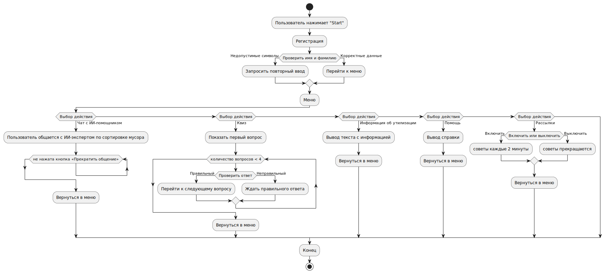
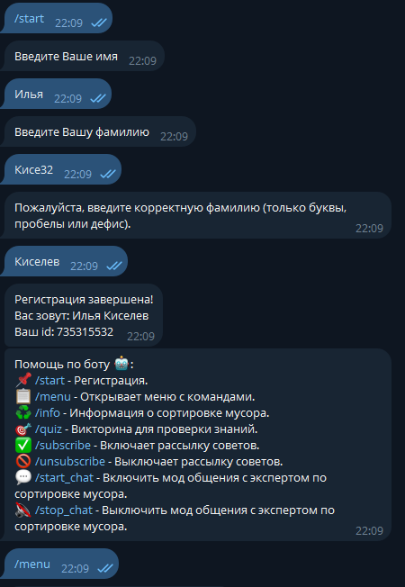
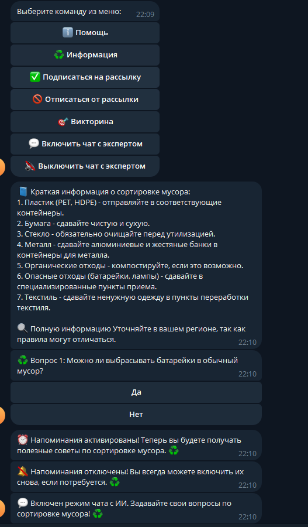
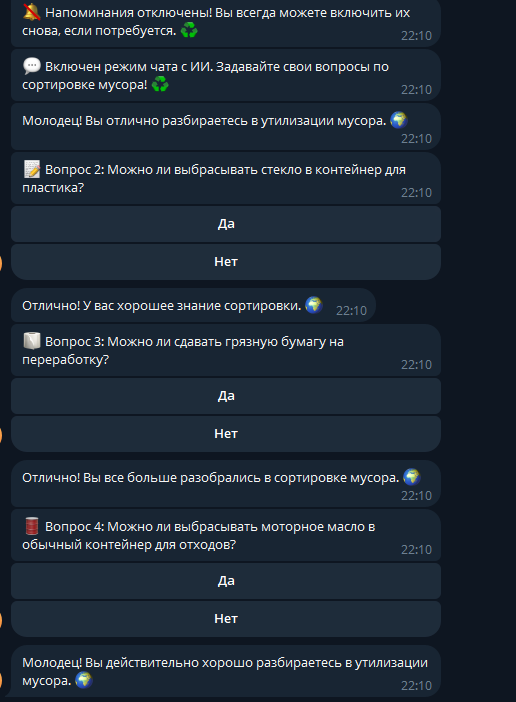
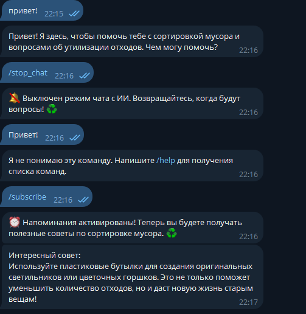

# Telegram-бот для помощи в сортировке мусора

Данный проект представляет собой разработку Telegram-бота с использованием библиотеки `aiogram 3`, который интегрирует несколько ключевых инструментов и технологий, включая:

* Машину состояний(FSM) для регистрации пользователей.
* Middleware для проверки зарегистрированности пользователя при вызове команд.
* Большую языковую модель(Gigachat) для взаимодействия с пользователем, обработки запросов и ответов.
* LangChain для работы с памятью, промптами и цепочками.
* Apsheduler для реализации напоминаний и периодических сообщений.

Схема работы:

Скриншоты работы:

### Испольнители: Киселев Илья, Фомина Алина.
### Группа: БИТ233